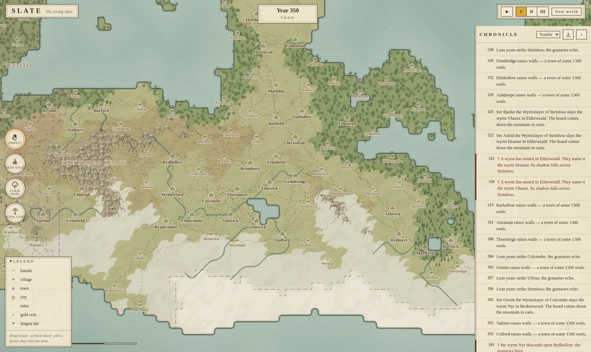

# SLATE — Phase 0 prototype: "The Living Atlas"

The [roadmap's](../god-sim-design/07-roadmap.md) Phase 0 "Proof of Life," built as a
zero-install browser app: a deterministic god-simulation with an illustrated,
self-drawing atlas on top. **The world runs entirely on its own** — cultures land,
spread, strike gold, starve, breed dragons, and write it all down. You can watch,
or you can intervene with the three founding-note powers and watch the cascades.

## Run it

- **Zero-install:** open `dist/slate-atlas.html` in any browser (one self-contained file).
- **Dev:** serve the folder (`python3 -m http.server`) and open `index.html`.
- **Rebuild the single file:** `node build.js`.
- **Simulation tests:** `node test/headless.js` — five god-less 500-year histories
  (~0.9 s each), determinism check, divergence check, and all three power cascades
  (gold → mining boom, curse → exodus, bless → settlers).
- **Screenshots:** `node test/shot.js` (uses the preinstalled Chromium via playwright-core).

URL params: `?seed=42` picks a world, `&run=350` fast-forwards 350 years on load.

## What's inside

| Piece | Where | Notes |
|---|---|---|
| Deterministic sim core | `src/{rng,worldgen,world,sim,powers}.js` | Monthly tick; seeded RNG streams; runs headless in Node — this is the part that ports to C#/engine later |
| The Chronicle | `src/chronicle.js` | Append-only event log with prose templates; exports Markdown (the campaign-setting-forge seed) |
| Naming | `src/names.js` | Four cultures with distinct phoneme banks; regions, people, epithets, dragons |
| Atlas renderer | `src/render/*` | Procedural cartography: watercolor biomes, traced ink coastlines, hachured mountains, stippled forests, culture borders, collision-managed labels, animated storms/pings/arrows |
| UI chrome | `src/ui.js`, `style.css` | Cartouche bar, seal-button powers, ledger chronicle, legend, tooltips |

## Powers (the founding examples)

- **Seed Gold** (mountains/hills): prospectors → mining camps → boomtowns → wealth
  → *dragons*. Watch a century of consequences from one click.
- **Curse Skies:** a permanent storm, five leagues wide; fields die, people flee, roads empty.
- **Bless Land:** kind soil; empty country attracts settlers.

Everything a god does is chronicled in gold ink. Everything the world does on its
own is chronicled too — famines, wall-raisings, wyrm nestings, and the occasional
"Ser Eda the Wyrmslayer" who kills two dragons in four years, entirely emergent.

## What this proves (per the design bible)

- **Autonomy:** observer mode is the test suite — histories run with zero divine input.
- **Divergence:** seeds produce different-shaped worlds (checked in CI-style asserts).
- **Cascades:** the founder-note interventions produce systemic, multi-decade consequences.
- **The Atlas zoom band** (design doc 04) is real: the map *is* the fantasy map, and it redraws itself as history unfolds.

## Known limits (deliberate Phase 0 cuts)

Faith/religion, Figures with relationships, wars, myth-drift, time-scrubbing, and
3D are all later phases — see the roadmap. The JS sim is the *design spec in code*;
the production core gets ported to C# when an engine enters (Phase 1 gate).
